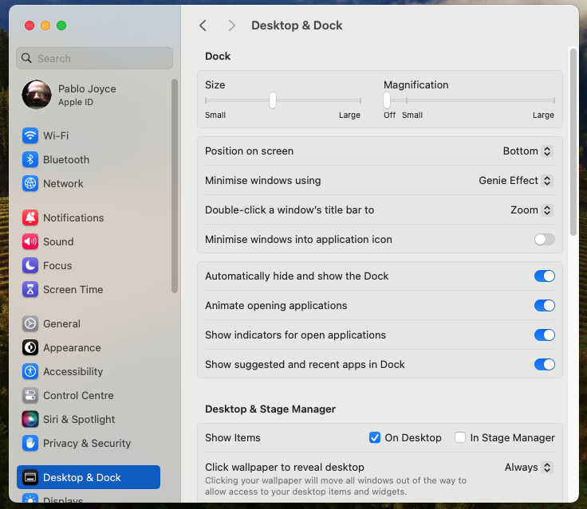
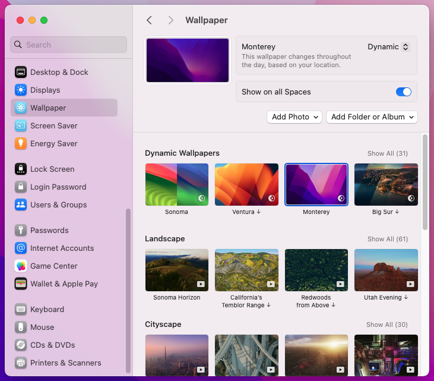
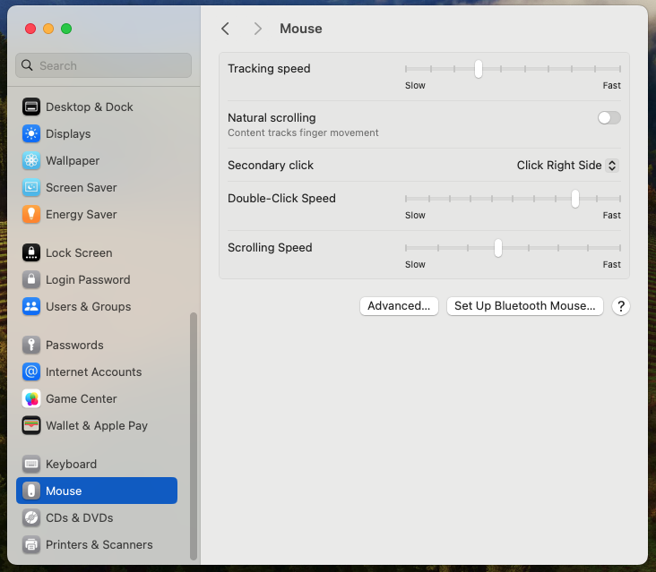
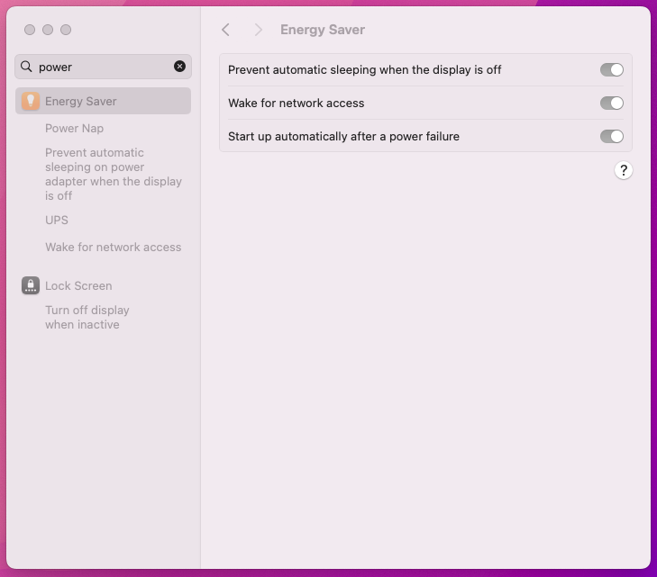
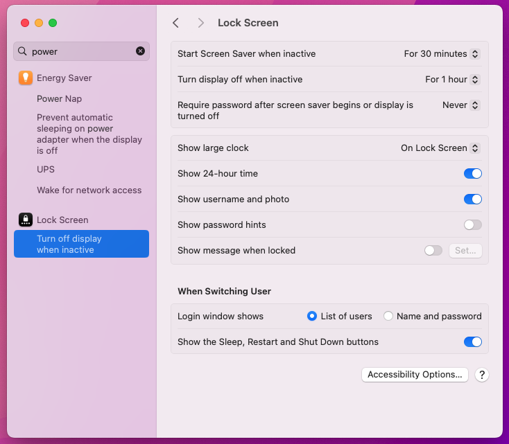
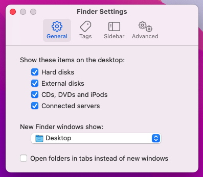
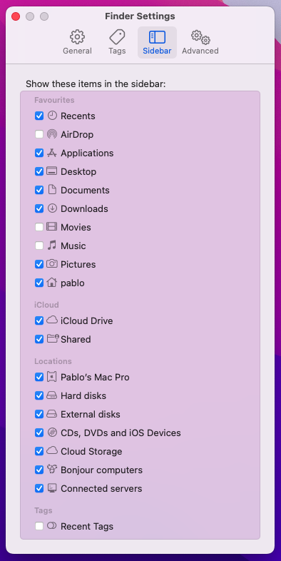
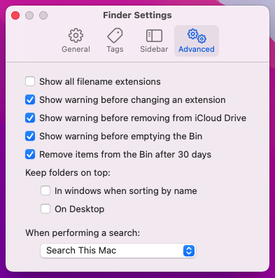

# Mac OS Settings

As a personal note, here are some of the settings that I tend to chnage right away when setting up a new Mac.

## Dock

I like to have the dock hide automatically.

## Wallpaper

Still loving the Monterey wallpaper.

## Mouse

Unchecking natural scrolling works for me.

## Energy Saver

The toggles look off in the image below but they are actually all on.

Extend time periods and don't require password on wake.

## Finder settings

Show all drives and stop folders opening in tabs.

Show desired folders in the sidebar and hide tags.

I have started to check removing items from the trash after 30 days.

